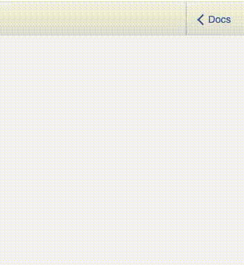

## GraphQL Introduction

### Getting Started

To get the GraphQL server started, type `npm run start-graphql` in the terminal and go to localhost:4001/graphql. The GraphQL interface at this port is enabled by setting `graphiql: true` in the graphql_app.js file.

To get the endpoints that are currently available, click on the "< Docs" on the upper-right hand side of the screen to open the Documentation Explorer. This Documentation Explorer allows you to click through the different RootQueries and display the schema for those queries.



---

### Querying

Unlike RESTful APIs, GraphQL allows the client to determine what information the server returns. For example, our NumberQueryType _can_ pass back facts about the number as types: trivia, date, math, or year. But if the user only wants the math fact, they can specify only the math fact should be passed back.

Example queries (user puts in number in place of int):

Get all facts about a specific number

```
query {
  number(number: int) {
    trivia
    date
    math
    year
  }
}
```

Only get the math facts about a specific number

```
query {
  number(number: int) {
    math
  }
}
```

---

### Expected Output

The expected output is a JSON object, in which each fact type's value is an array of strings with each fact as an element if there is a valid fact for that type and number.

```
query {
  number(number: 255) {
    trivia
    math
  }
}
```

The expected output for this is:

```
{
  "data": {
    "number": {
      "trivia": [
        "the largest representable integer in an unsigned byte",
        "the largest values that can be assigned to elements in the 24-bit RGB color model, since each color channel is allotted eight bits"
      ],
      "math": [
        "a repdigit in base 2 (11111111) in base 4 (3333), and in base 16 (FF)"
      ]
    }
  }
}
```

If there is not a valid fact for a number and a type, there will be a semi-randomized default message and a suggestion to submit your own fact to Rithm. This is also returned as an array.

```
query {
  number(number: -99) {
    year
  }
}
```

The expect output for this is:

```
{
  "data": {
    "number": {
      "year": [
        "99 BC is the year that nothing remarkable happened. Have a better fact? Submit one at github.com/rithmschool/numbers_api."
      ]
    }
  }
}
```
